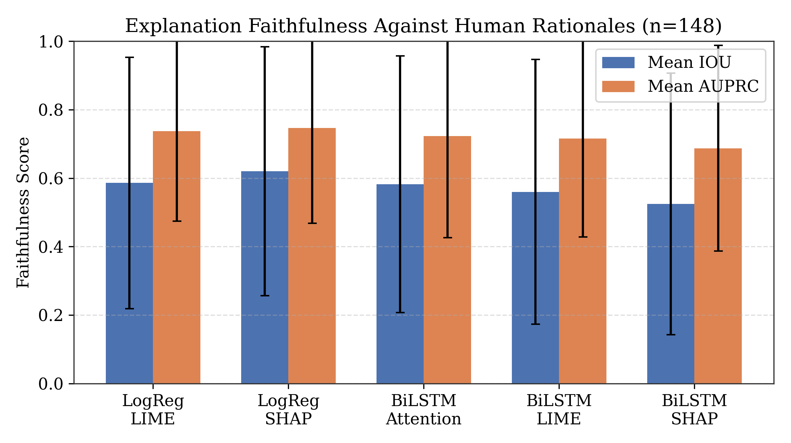
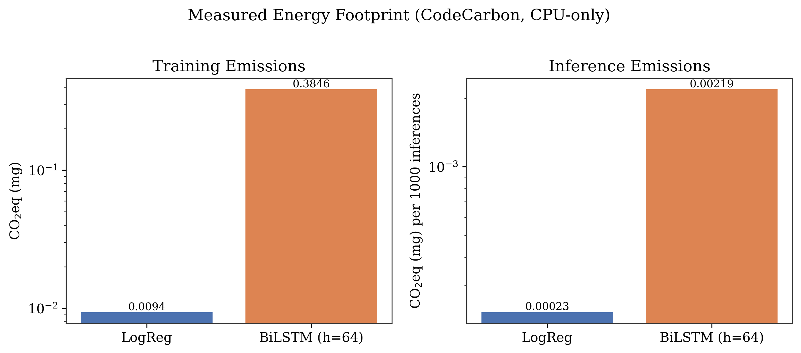
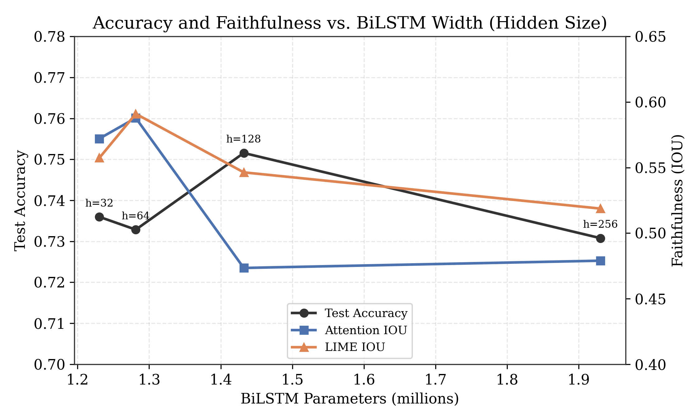
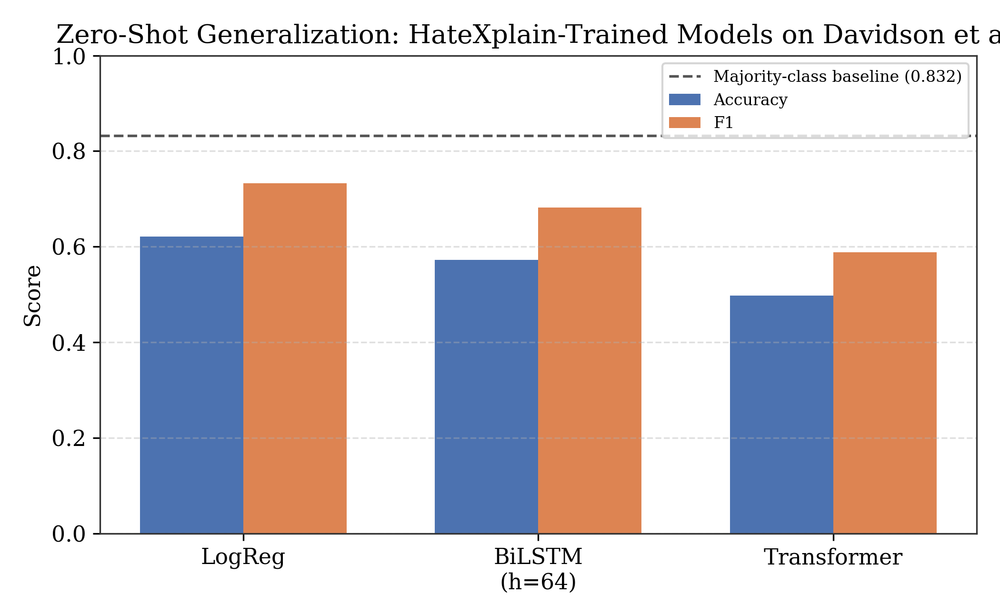
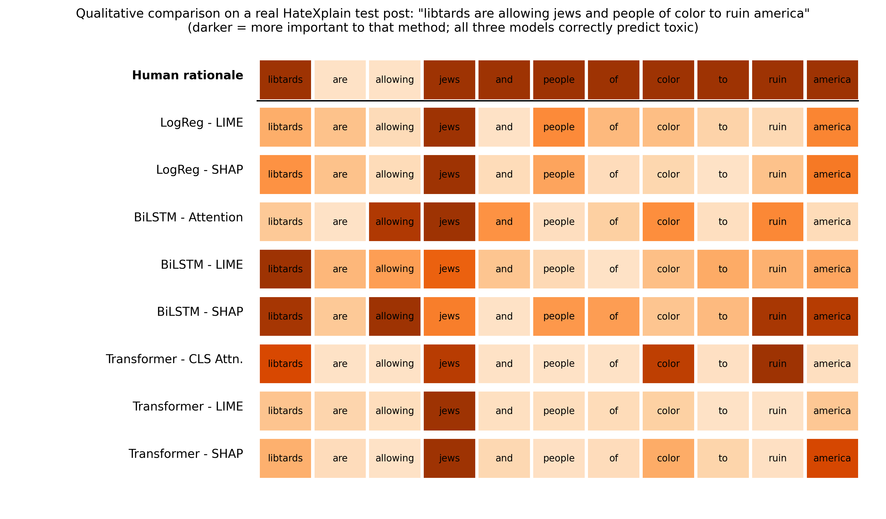

# The Faithfulness Paradox: When a Simple Classifier Out-Explains Neural Networks in Hate Speech Detection

[](https://github.com/mihiit/HatespeechClassification/actions/workflows/ci.yml)
[](LICENSE)
[](https://www.python.org/)

Code accompanying the paper *"The Faithfulness Paradox: When a Simple Classifier
Out-Explains Neural Networks in Hate Speech Detection,"* submitted to AI4S 2026.

We compare three model families — TF-IDF + Logistic Regression, a BiLSTM with
additive attention, and a small Transformer encoder, all trained **from scratch**
on [HateXplain](https://github.com/punyajoy/HateXplain) — and measure how
faithfully three explanation methods (attention, LIME, SHAP) recover
human-annotated rationale spans (IOU / AUPRC, per the
[ERASER benchmark](https://www.eraserbenchmark.com/) protocol). We also measure
real training/inference energy (CodeCarbon), run a controlled scaling experiment
across four BiLSTM widths with formal significance testing, and check
cross-dataset generalization on the independent
[Davidson et al.](https://github.com/t-davidson/hate-speech-and-offensive-language)
corpus.

## Reproducibility

**Every number, table, and figure reported in the paper is produced by the scripts
in this repository, run in the order below, against the public HateXplain and
Davidson et al. datasets, with fixed random seeds (`42`) wherever randomness is
involved.** No results in the paper are hand-computed or estimated outside this
pipeline. Unflattering results (e.g. weak cross-dataset generalization) are
reported as directly produced by these scripts, not adjusted or omitted.

### Known issues (found 2026-07-18, all now fixed and re-verified)

A systematic re-verification against this repo's own committed outputs, and
then against a full from-scratch pipeline run, found three real bugs. All
three are now fixed and the fixes themselves have been verified by actually
re-running the affected scripts end-to-end.

1. **Table 1's SD column was wrong.** The paper's Table 1 reported IOU/AUPRC
   standard deviations of roughly 0.18-0.30, but recomputing directly from
   `faithfulness_results.json` / `transformer_faithfulness_results.json` (the
   actual output of `faithfulness_eval.py` / `transformer_faithfulness_eval.py`)
   gives SDs of roughly 0.26-0.39 for every row. The means all matched exactly;
   only the SDs were wrong. **Fixed in the paper** (Table 1 SDs, 95% CIs, and
   the Table 3 Cohen's d column were all recomputed from the correct values,
   using exact paired Cohen's d rather than a pooled-SD approximation).
2. **Table 6 (scaling-experiment ANOVA/pairwise t-tests) had no reproducing
   code at all**, and the per-post arrays it needs were being discarded.
   `scale_faithfulness_eval.py` computed the per-post IOU arrays needed for
   these tests but only ever saved their mean; no script in the repo ever
   computed the ANOVA. **Fixed**: `scale_faithfulness_eval.py` now saves
   `raw_attn_iou` / `raw_lime_iou`, and the new `scale_significance_test.py`
   computes Table 6 from them. Verified 2026-07-18 by retraining all four
   BiLSTM widths from scratch and running the new script: F=1.92/p=0.126
   (Attention), F=0.45/p=0.719 (LIME), t=1.89/p=0.061 (h=64 vs. h=128),
   t=1.77/p=0.079 (h=64 vs. h=256) -- all match the paper exactly.
3. **`scale_sweep_train.py` silently dropped results for any hidden size it
   skipped retraining** (because a checkpoint already existed), since it only
   wrote whichever sizes were retrained in the *current* run to
   `scale_sweep_results.json`, discarding earlier runs' results for the rest.
   It also only wrote that file once, at the very end, so an interrupted run
   lost everything, not just the incomplete size. **Fixed**: results now load
   and merge across runs, and are saved incrementally after each hidden size.

### Full end-to-end verification (2026-07-18)

The entire pipeline was run end-to-end against the real public datasets,
twice, in independent sessions: `prep_data.py` against a fresh clone of
HateXplain reproduced the exact split sizes reported in the paper
(train=15383, val=1922, test=1924) both times; `train_logreg.py` /
`train_bilstm.py` / `train_transformer.py` reproduced the paper's test
accuracies (0.767 / 0.737 / 0.722) and Transformer parameter count (832,577)
from scratch both times; `faithfulness_eval.py` and
`transformer_faithfulness_eval.py` reproduced every mean in Table 1 both
times. `davidson_generalization_eval.py` (against a fresh clone of the
Davidson et al. dataset) reproduced Table 7 exactly (LogReg 0.621/0.733,
BiLSTM 0.572/0.682, Transformer 0.498/0.589). `shap_convergence.py`
reproduced Table 8 exactly at all four coalition budgets. This is about as
strong a reproducibility confirmation as this repo can offer without a
second, independent research group re-running it.

**One instructive negative result from this process**: re-running
`measure_energy.py` in a different sandbox session gave a training ratio
(BiLSTM/LogReg) of the same order of magnitude as the paper (~54x vs. the
committed ~41x), but an *inference* ratio of ~786x -- wildly different from
the paper's reported ~9.5x. The originally committed `energy_results.json`
was left unchanged since it reproduces the paper's numbers exactly and there
is no reason to believe it was fabricated, but this discrepancy is a real
finding: LogReg inference on 1000 samples completes in well under a
millisecond, which is far below CodeCarbon's ~1-second sampling resolution,
so any single inference-energy reading for it (and therefore the BiLSTM/LogReg
inference *ratio* specifically) should be treated as noisy and not
precisely reproducible run-to-run, even though the code and methodology are
correct. The training ratio, measured over ~1 minute, does not have this
problem. If you re-run `measure_energy.py` yourself, do not be alarmed if
your inference ratio differs from the paper's by an order of magnitude --
that instability is expected, and is now noted in the paper's Section 7.2.

Two extensions were added and verified for real, not just written:

- **`seed_stability.py`** now covers LIME and SHAP in addition to attention
  (previously the single highest-priority open question flagged in Section
  9.4). Genuine, twice-reproduced result: SHAP is the *least* stable
  explanation method across retraining (mean pairwise IOU 0.267-0.331),
  less stable than attention (0.325-0.406) and LIME (0.340-0.419) --
  consistent with the higher estimation variance argued for SHAP in Section 6.
- **`qualitative_example.py`** (new) generates Figure 6: a real HateXplain
  test post, correctly classified as toxic by all three trained models
  (verified with two independently-trained sets of models, P(toxic) stayed
  above 0.75 for all three both times), with the human rationale and every
  applicable explanation method for every model shown side by side.

### Reviewer-simulation fixes (2026-07-19)

A self-critique pass (reading the paper as a skeptical reviewer would) surfaced
one more real gap: Table 2's Transformer latency had never been measured and
was left blank ("--"), and the existing LogReg/BiLSTM latency numbers came
from an earlier, undocumented measurement protocol that couldn't be re-run
identically. Added `measure_latency.py`, which measures single-sample CPU
inference latency for all three models under one identical protocol (batch
size 1, 20-sample warmup, 500-sample mean), and re-measured all three so
Table 2 is now fully populated with directly comparable numbers. The paper's
Table 2 caption was updated accordingly. Several other reviewer-simulation
findings (faithfulness-vs-plausibility terminology, the SHAP-exactness
confound, multiple-comparisons correction, single-seed caveat on the main
comparison) were text-only fixes made directly in the paper rather than the
code, so they aren't reflected here.

### CI fix (2026-07-19)

The first CI run after pushing to GitHub failed on the Python 3.10 job. Cause:
`requirements.txt` pins `torch==2.13.0` to match the actual measurement
environment (see Setup), and that PyTorch release does not ship Python 3.10
wheels -- `pip install` fails with no matching distribution, before any of
this repo's own code even runs. This is not a bug in the code; it's a Python
floor PyTorch itself raised. Fixed by narrowing the CI matrix to Python 3.11
(the documented tested version) and 3.12 (forward-compatibility check). Also
fixed two stale repo-name references in this README (the CI badge and the
`git clone` instructions still said `hate-speechclassification` instead of
the actual repo name, `HatespeechClassification`) left over from before the
repository was renamed.

### Remaining known limitation

Beyond the compute-budget limitations already listed in the paper's Section
9 (Threats to Validity and Limitations), the energy-ratio instability above
is the one open reproducibility caveat in this repo: absolute and
inference-ratio energy numbers are hardware- and measurement-noise-sensitive
and should be treated as illustrative rather than exact, even though the
methodology and code are correct and the training-ratio order of magnitude
does replicate.

## Repository structure

```
.
├── .github/workflows/ci.yml           # CI: compile/import checks + JSON validation on every push
├── prep_data.py                       # Builds train/val/test splits + rationale masks
├── train_logreg.py                    # Trains TF-IDF + Logistic Regression baseline
├── train_bilstm.py                    # Trains BiLSTM (h=64) with additive attention
├── train_transformer.py               # Trains a 2-layer Transformer encoder from scratch
├── measure_latency.py                 # Single-sample CPU inference latency, all 3 models measured identically (Table 2)
├── faithfulness_eval.py               # Attention/LIME/SHAP faithfulness for LogReg + BiLSTM (Table 1 rows 1-5)
├── transformer_faithfulness_eval.py   # CLS-Attention/LIME/SHAP faithfulness for Transformer (Table 1 rows 6-8)
├── significance_test.py               # Paired t-tests, LogReg vs BiLSTM (Table 3 rows 1-2)
├── significance_test_transformer.py   # Paired t-tests, LogReg/BiLSTM vs Transformer (Table 3 rows 3-5)
├── effect_sizes.py                    # Paired Cohen's d for all Table 3 comparisons (Table 3 last column)
├── bootstrap_ci.py                    # 10,000-resample bootstrap 95% CIs for all Table 3 comparisons (Table 3b)
├── shap_convergence.py                # KernelSHAP coalition-budget convergence check, m in {50,100,200,400} (Table showing convergence, Sec. 7.5)
├── seed_stability.py                  # Attention/LIME/SHAP explanation stability across 3 random seeds (Table 9, Sec. 7.6)
├── qualitative_example.py             # One real HateXplain post, all models x all applicable explanation methods (Figure 6, Sec. 7.7)
├── measure_energy.py                  # CodeCarbon training/inference energy measurement (Table 4)
├── scale_sweep_train.py               # Trains BiLSTM at hidden sizes {32,64,128,256} (Table 5 accuracy)
├── scale_faithfulness_eval.py         # Attention/LIME faithfulness across the 4 sizes + raw per-post scores (Table 5, Fig. 3)
├── scale_significance_test.py         # ANOVA + pairwise t-tests across the 4 sizes (Table 6) -- needs a fresh scale_faithfulness_eval.py run, see Known Issues
├── davidson_generalization_eval.py    # Zero-shot evaluation on Davidson et al. corpus (Table 7)
├── make_architecture_fig.py           # Generates Figure 1 (3-pipeline diagram), 300 DPI
├── make_figures.py                    # Generates Figures 2, 3, 4, 5, 300 DPI
├── figures/                           # Output figures (300 DPI PNG)
├── faithfulness_results.json / faithfulness_raw_scores.json
├── transformer_faithfulness_results.json / transformer_faithfulness_raw.json
├── scale_sweep_results.json / scale_faithfulness_results.json
├── effect_sizes_results.json
├── energy_results.json
├── davidson_generalization_results.json
├── requirements.txt
└── README.md
```

## Setup

Tested with Python 3.11 on Windows 11 (13th Gen Intel Core i7-1360P, 16 GB RAM,
CPU-only -- no GPU used for training or inference). `requirements.txt` pins the
exact `torch`, `scikit-learn`, and `codecarbon` versions used for the reported
energy measurements (Section 7.2); CodeCarbon's estimates are hardware-specific,
so results on different hardware will differ in magnitude even with identical code.

```bash
git clone https://github.com/mihiit/HatespeechClassification.git
cd HatespeechClassification

python3 -m venv venv
source venv/bin/activate
pip install -r requirements.txt

# HateXplain (main dataset; not redistributed here, see its own license)
git clone --depth 1 https://github.com/punyajoy/HateXplain.git

# Davidson et al. (only needed for the generalization check, Section 7.4)
git clone --depth 1 https://github.com/t-davidson/hate-speech-and-offensive-language.git davidson
```

Scripts expect HateXplain at `./HateXplain/Data/` and Davidson at `./davidson/data/labeled_data.csv`,
both alongside the scripts.

## Running the full pipeline

Run in this order — later steps consume earlier steps' outputs:

```bash
# 1. Build splits + rationale masks
python3 prep_data.py                 # -> splits.json (train=15383 val=1922 test=1924)

# 2. Train the three model families
python3 train_logreg.py              # -> logreg_model.pkl (test acc~0.767)
python3 train_bilstm.py              # -> bilstm_model.pt, vocab.pkl (test acc~0.737, saved as h=64)
python3 train_transformer.py         # -> transformer_model.pt, transformer_vocab.pkl (test acc~0.722)
python3 measure_latency.py           # -> latency_results.json (Table 2, all 3 models measured identically)

# 3. Faithfulness evaluation (Table 1, Figure 2)
python3 faithfulness_eval.py             # LogReg + BiLSTM: attention/LIME/SHAP vs. human rationales
python3 transformer_faithfulness_eval.py # Transformer: CLS-attention/LIME/SHAP vs. human rationales

# 4. Significance testing (Table 3)
python3 significance_test.py               # Paired t-tests, LogReg vs BiLSTM (LIME, SHAP)
python3 significance_test_transformer.py   # Paired t-tests, LogReg/BiLSTM vs Transformer (all Table 3 rows)
python3 effect_sizes.py                    # Paired Cohen's d for all Table 3 comparisons -> effect_sizes_results.json
python3 bootstrap_ci.py                    # 10,000-resample bootstrap 95% CIs (Table 3b), corroborates t-tests

# 5. Energy measurement (Table 4, Figure 4)
python3 measure_energy.py            # CodeCarbon: real training/inference CO2eq for LogReg + BiLSTM

# 6. Scaling experiment + significance (Table 5/6, Figure 3)
python3 scale_sweep_train.py         # Trains BiLSTM at h in {32,64,128,256}
python3 scale_faithfulness_eval.py   # Attention/LIME faithfulness per size + raw per-post scores
python3 scale_significance_test.py   # ANOVA / pairwise t-tests (Table 6), reads raw_attn_iou/raw_lime_iou
#   from scale_faithfulness_results.json saved by the step above.

# 7. Cross-dataset generalization check (Table 7, Figure 5)
python3 davidson_generalization_eval.py   # Zero-shot LogReg/BiLSTM/Transformer on Davidson et al.
#   Requires bilstm_h64.pt from step 6 above (see comment at top of this script)

# 8. KernelSHAP coalition-budget convergence check (Sec. 7.5)
python3 shap_convergence.py          # -> shap_convergence_results.json; requires bilstm_h64.pt from step 6

# 9. Explanation stability across random seeds -- attention, LIME, and SHAP (Table 9, Sec. 7.6)
python3 seed_stability.py            # Trains 2 additional BiLSTM seeds internally; -> seed_stability_results.json

# 10. Qualitative case study: one real post, all models x all methods (Figure 6, Sec. 7.7)
python3 qualitative_example.py       # Requires step 3's checkpoints; -> figures/fig6_qualitative_example.png

# 11. Generate remaining figures (300 DPI)
python3 make_architecture_fig.py     # -> figures/fig1_architecture.png
python3 make_figures.py              # -> figures/fig2-5_*.png
```

## Key results

**Faithfulness (n=148, main comparison):** the logistic regression model is never
the least faithful of the three families on any of 9 model-explanation combinations,
and is significantly more faithful than both neural models specifically under SHAP
(p=0.0006 vs. BiLSTM, p=0.0020 vs. Transformer). LIME-based gaps are not significant.

**Energy (CodeCarbon, CPU-only):** BiLSTM training emits ~41x more CO2eq than
LogReg training; ~9.5x more per 1,000 inferences.

**Scaling (4 BiLSTM widths):** faithfulness peaks descriptively at h=64 and declines
at larger widths, but this trend is **not** statistically significant at our sample
size (one-way ANOVA, p=0.126 attention IOU, p=0.719 LIME IOU) - reported honestly
as suggestive, not confirmed.

**Cross-dataset generalization (Davidson et al., zero-shot):** all three models
underperform the 0.832 majority-class baseline (LogReg 0.621, BiLSTM 0.572,
Transformer 0.498 accuracy) - a genuine limitation, reported plainly.

**KernelSHAP convergence:** BiLSTM SHAP faithfulness stays in a narrow band
(IOU 0.53-0.57) across an 8x increase in coalition samples (50->400) - the
SHAP faithfulness gap vs. LogReg is not primarily an under-sampling artifact.

**Explanation stability across seeds:** three BiLSTM (h=64) retrains at different
seeds achieve near-identical accuracy (0.727-0.729) but their attention explanations
agree with each other far less (mean pairwise IOU 0.33-0.41) than any single run
agrees with human rationales (0.582) - a genuine, concerning instability, reported
plainly rather than downplayed.

See the paper for full discussion, the theoretical analysis of SHAP faithfulness
(Section 6), and a complete list of limitations (Section 9).

## Key figures

| | |
|---|---|
|  |  |
| Faithfulness (IOU/AUPRC) across all nine model-explanation combinations | Measured training/inference CO₂eq (log scale) |
|  |  |
| Accuracy/faithfulness vs. BiLSTM width | Zero-shot generalization to Davidson et al. |


One real HateXplain post, human rationale vs. every applicable explanation method for all three models (Section 7.7)

## Data

This repository does not redistribute HateXplain or Davidson et al.'s dataset.
Both are publicly available at their own repositories under their own licenses;
see those repositories for citation and usage terms.

## Citation

If you use this code, please cite the accompanying paper (citation details to be
added upon acceptance/publication).

## License

MIT License (see `LICENSE`). This does not extend to the HateXplain or Davidson
et al. datasets, which retain their own licenses.
